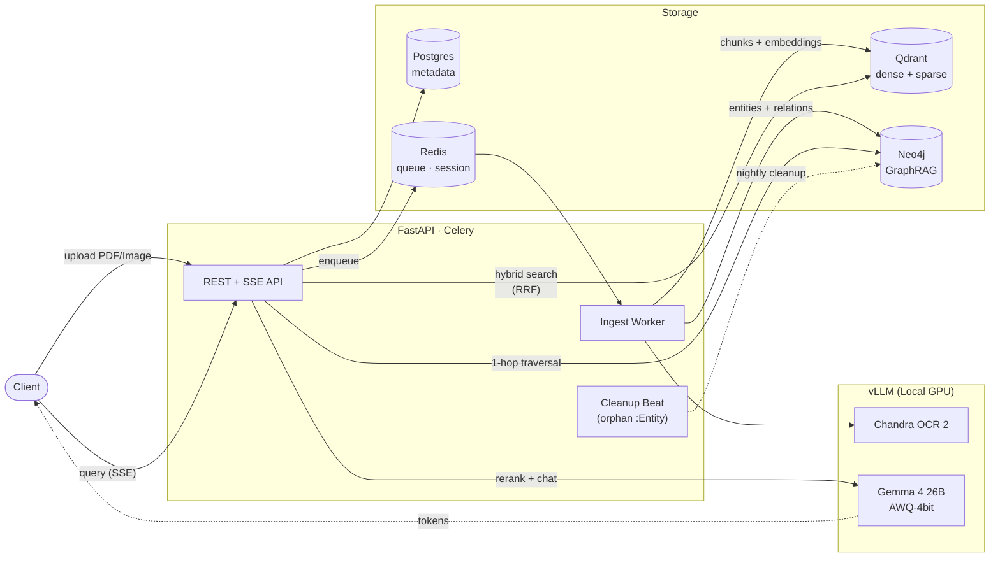

# GraphRAG Engine — 하이브리드(Vector + Graph) 온프레미스 RAG


> 한국어 PDF/이미지를 OCR → 벡터(Qdrant dense+sparse) + 지식그래프(Neo4j) 동시 인덱싱하고,
> 쿼리 라우팅 → 하이브리드 검색 → BGE 리랭킹 → vLLM SSE 스트리밍까지 **단일 엔드포인트**로
> 묶은 온프레미스 GraphRAG 엔진. 외부 LLM API 의존 없이 한 박스에서 완결된다.

### Highlights

- **Hybrid retrieval** — Qdrant dense+sparse RRF Fusion + BGE-Reranker v2-m3 cross-encoder (`app/retrieve/`)
- **GraphRAG** — Neo4j `Document→Chunk→Entity` + 1-hop `RELATES_TO` traversal augments vector results (`app/ingest/graph_extract.py`)
- **Query router** — LLM-classified intent (`casual / fact / analysis`) skips or biases retrieval per request
- **vLLM serving** — Gemma 4 26B AWQ-4bit + Chandra OCR 2 sharing a single GPU (memory split `0.55 / 0.25`)
- **Async ingest** — FastAPI → Celery → vLLM OCR → embed → Qdrant+Neo4j, with SSE progress and SHA256 idempotent dedup
- **Multi-tenant** — Bearer API key (sha256-hashed) with per-tenant slowapi rate limit and `current_tenant` DI
- **Evaluation** — RAGAS-style `/v1/evaluate` exposes faithfulness · answer_relevancy · context_precision · context_recall
- **Operability** — orphan `:Entity` cleanup Celery beat (`cleanup.orphan_entities`, dry-run default), structlog JSON logs, alembic migrations
- **Tests** — 229 unit + integration + load tests, TDD workflow (see [`docs/OPERATIONS.md`](docs/OPERATIONS.md))

---

DGX Spark (NVIDIA GB10, ARM64) 위에서 단독으로 동작하는 **하이브리드 RAG LLM 엔진**.
벡터(Qdrant dense+sparse RRF) + 그래프(Neo4j GraphRAG)를 결합하고, 외부 LLM API 없이
로컬 vLLM에서 Gemma 4 / Chandra OCR 2를 서빙한다. 멀티테넌트 API 키 인증과 SSE 스트리밍
응답을 지원한다.

> **에어갭 운영**: 모든 컴포넌트(LLM·OCR·벡터·그래프·DB·캐시)가 단일 노드에 상주하며 외부
> 인터넷 없이 동작한다. 모델 가중치·컨테이너 이미지·Python 휠은 사전 미러링 단계에서만
> 외부와 통신하고, 이후 추론·인제스트·평가 전 구간이 폐쇄망 안에서 완결된다.

---

## 한눈에

- **엔진 종류**: Hybrid RAG (Vector ⊕ Graph). 라우터 LLM이 질의를 `casual / fact / analysis`
  3-모드로 분류 후 retrieve→rerank→generate 파이프라인을 실행.
- **타겟 하드웨어**: DGX Spark / ARM64. 단일 박스에서 `docker compose up` 한 번으로 부팅.
- **외부 의존**: HuggingFace (모델 다운로드용) 외에는 외부 API 호출 없음.
- **인증**: Bearer API 키 + sha256 해시 저장, tenant 단위 격리.
- **스트리밍**: FastAPI SSE — `citation / token / done / error` 4가지 이벤트.
- **현재 상태**: Phase 0–6 완료. Phase 7 옵셔널 4개 중 3개(GraphRAG retriever / RAGAS
  `/v1/evaluate` / BGE-Reranker v2-m3) 완료, Admin UI만 잔여. 운영 자동화로 orphan
  `:Entity` 정리 Celery 작업(`cleanup.orphan_entities`, dry-run 기본) 추가. 단위 테스트
  229 pass / 95%+ 커버리지. 정확한 수치는 `pytest tests/unit --cov=app`로 재측정 가능.

---

## 아키텍처



### 서비스 구성 (docker-compose)

| 서비스 | 역할 | 비고 |
|---|---|---|
| `app` | FastAPI HTTP + SSE | 인증·라우팅·쿼리/업로드/조회 API |
| `celery-worker` | 비동기 인제스트 워커 | `--concurrency=2`, 큐 = Redis DB1 |
| `vllm-gemma` | Gemma 4 26B AWQ-4bit | OpenAI 호환 `/chat/completions`, GPU mem util **0.55** |
| `vllm-chandra` | Chandra OCR 2 | OpenAI 호환 chat, image_url(data URI) 입력, GPU mem util **0.25** |
| `qdrant` | 벡터 DB | 컬렉션 `chunks`, named vectors `dense`(1024d) + `sparse` |
| `neo4j` | 그래프 DB | community 2026.04 + APOC, bolt 7687 |
| `postgres` | 메타데이터 | SQLAlchemy 2.0 async + Alembic |
| `redis` | 캐시/큐/세션/레이트리밋 | DB0 캐시, DB1 Celery broker, DB2 Celery backend |

GPU는 vLLM 두 컨테이너가 분할 점유한다 (Gemma 0.55 + Chandra 0.25 ≈ 0.80).

### 데이터 흐름

**Ingest (Upload → Index)**

```
POST /v1/upload (multipart)
  │
  ▼
SHA-256 dedupe (tenant 범위) ──► Document + Job row (Postgres)
  │
  ▼
Celery: ingest.document
  │
  ├─► OCR  : Chandra (per-page Markdown, image_url data URI)
  ├─► Chunk: RecursiveCharacterTextSplitter(sep=["\n\n","\n",". "," "])
  ├─► Embed: BGE-M3 singleton (dense 1024d + sparse lexical weights)
  ├─► Vector upsert (Qdrant)
  │     named vectors: dense + sparse
  │     payload: tenant_id, document_id, filename, page, doc_type,
  │              chunk_index, text
  ├─► GraphRAG extract (Gemma per-chunk, Semaphore=graphrag_extract_concurrency)
  │     {entities:[{name,type,description}],
  │      relations:[{source,target,kind,description}]}
  └─► Graph upsert (Neo4j)
        (:Document)<-[:PART_OF]-(:Chunk)-[:MENTIONS]->(:Entity)
        (:Entity)-[:RELATES_TO {kind}]->(:Entity)
        Entity dedup key = (tenant_id, name, type)
  │
  ▼
Job.progress 0.0 → 1.0, status pending → running → completed
SSE: GET /v1/jobs/{id}/stream  (event: progress / done / error)
```

**Query (Retrieve → Rerank → Generate)**

```
POST /v1/query
  │
  ▼
Router LLM (Gemma, 4-token, mode = casual/fact/analysis)
  └─ fail → fact 폴백,  casual → retrieve 생략
  │
  ▼
┌── Vector hybrid_search (Qdrant Prefetch dense+sparse → RRF Fusion, top_k*oversample)
├── Graph search (Cypher: Entity 시드 → 1-hop RELATES_TO → Chunk MENTIONS)
└── 두 경로 parallel
  │
  ▼
Merge (graph first, (document_id, chunk_index) dedup)
  │
  ▼
Rerank (BGE-Reranker v2-m3 CrossEncoder, sigmoid; 실패 시 원순서 유지)
  │
  ▼
Prompt render (system rules + prior_summary + prior_turns + passages)
  │
  ▼
vLLM Gemma /chat/completions (SSE)
  └─ events: citation → token (반복) → done   (또는 error)
  │
  ▼
Redis 세션 메모리 갱신
  └─ turns LIST + summary STRING, 30분 sliding TTL, 오버플로 시 Gemma 요약 fold
```

---

## 모듈 맵 (`app/*`)

| 모듈 | 책임 |
|---|---|
| `app/api` | 7개 라우터 (`health`, `auth`, `upload`, `jobs`(+SSE), `query`(+SSE), `documents`, `evaluate`) |
| `app/core` | Bearer+sha256 인증, slowapi 레이트리밋, 도메인 예외 |
| `app/db` | Qdrant/Neo4j/Postgres/Redis/vLLM 싱글톤 클라이언트 + ping 헬스체크 |
| `app/deps` | `HTTPBearer` 스킴, AsyncSession DI, `current_tenant` 추출 |
| `app/ingest` | OCR → Chunk → Embed → Qdrant/Neo4j 단일 진입점 (`pipeline.py`, `graph_extract.py`, `graph_indexer.py`) |
| `app/retrieve` | router / vector(RRF) / graph(Cypher) / reranker 오케스트레이션 |
| `app/generate` | vLLM SSE 클라이언트, RAG 프롬프트 렌더링, Redis 세션 메모리 |
| `app/evaluate` | RAGAS 4 지표 (faithfulness, answer_relevancy, context_precision, context_recall) |
| `app/models` | SQLAlchemy ORM (`Tenant`/`ApiKey`/`Document`/`Job`) + Pydantic 스키마 |
| `app/workers` | Celery app + `ingest.document` 태스크 (Job/Document 상태 갱신) |
| `app/utils` | structlog JSON 로깅, sha256 해싱 헬퍼 |
| `app/config.py` | pydantic-settings 기반 환경설정 |
| `app/main.py` | FastAPI 엔트리포인트 |

---

## Quickstart

### 사전 요구사항

- **하드웨어**: DGX Spark (NVIDIA GB10) 또는 ARM64 + CUDA 가능한 GPU 박스.
- **OS**: Linux (ARM64). x86_64에서도 동작 가능하지만 vLLM 이미지 태그를 직접 맞춰야 함.
- **소프트웨어**: Docker ≥ 24, `docker compose` v2, NVIDIA Container Toolkit.
- **외부 토큰**: HuggingFace Hub 토큰 (`HUGGING_FACE_HUB_TOKEN`) — 모델 사전 다운로드용.

### `.env` 설정

```bash
cd llm-engine
cp .env.example .env
# 최소한 다음 4개는 운영 전 반드시 교체:
#   POSTGRES_PASSWORD=...
#   NEO4J_PASSWORD=...
#   APP_SECRET_KEY=...
#   HUGGING_FACE_HUB_TOKEN=hf_xxx
```

`alembic.ini`의 `sqlalchemy.url`이 plaintext placeholder(`change_me_postgres`)로
들어 있으니 운영 전에 환경변수 기반으로 치환할 것 (운영 노트 참조).

### 부팅 & 헬스체크

```bash
# 1) 모델 사전 다운로드 (공유 docker 볼륨)
./scripts/download_models.sh

# 2) 스택 기동
make up
make ps          # app + worker + vllm-gemma + vllm-chandra가 healthy까지 대기

# 3) DB 스키마 초기화 (idempotent)
docker compose exec app python -m scripts.init_db
docker compose exec app python -m scripts.init_qdrant
docker compose exec app python -m scripts.init_neo4j

# 4) 헬스체크
make health
# {"status":"ok","checks":{"postgres":"ok","qdrant":"ok","neo4j":"ok",
#   "redis":"ok","vllm_gemma":"ok","vllm_chandra":"ok"}}
```

### API 키 발급 (admin CLI)

```bash
docker compose exec app python scripts/create_api_key.py tenants
# (최초 실행 시 default tenant 자동 생성)

docker compose exec app python scripts/create_api_key.py issue \
  --tenant default --name demo
# ================================================================
# tenant   : default (<uuid>)
# key id   : <uuid>
# key name : demo
# PLAIN KEY (shown ONCE — store it now):
# graphrag_xxxxxxxxxxxxxxxxxxxxxxxxxxxxxxxxxxxx
# ================================================================

export SK=graphrag_xxxxxxxxxxxxxxxxxxxxxxxxxxxxxxxxxxxx
```

폐기는 `python scripts/create_api_key.py revoke --key-id <uuid>`.

### 첫 업로드 & 쿼리

**업로드** (PDF/이미지)

```bash
curl -s -X POST http://localhost:8000/v1/upload \
  -H "Authorization: Bearer $SK" \
  -F "files=@./tests/fixtures/sample_pdfs/korean_form.pdf" \
  -F "doc_type=policy" | jq
# {
#   "job_id": "<uuid>",
#   "accepted_files": [{"name":"korean_form.pdf","document_id":"<uuid>"}],
#   "rejected_files": []
# }
```

거절 사유는 `unsupported extension`, `duplicate (same content already indexed)`,
`too many files` 중 하나. 허용 확장자는 `.pdf .png .jpg .jpeg .webp .bmp .tiff`.

**Job 진행도 SSE 구독**

```bash
JOB=<job_id>
curl -sN "http://localhost:8000/v1/jobs/$JOB/stream" \
  -H "Authorization: Bearer $SK"
# event: progress
# data: {"id":"...","status":"running","progress":0.42,"error":null}
# ...
# event: done
# data: {"id":"...","status":"completed","progress":1.0,"error":null}
```

**쿼리 (JSON 단발)**

```bash
curl -s -X POST http://localhost:8000/v1/query \
  -H "Authorization: Bearer $SK" \
  -H "Content-Type: application/json" \
  -d '{"question":"국내 출장 일일 식비 한도가 얼마야?","top_k":5,"stream":false}' | jq
# {
#   "answer": "국내 출장 일일 식비 한도는 50,000원입니다 [korean_form.pdf].",
#   "sources": [{"filename":"korean_form.pdf","page":1,"chunk_index":0,"score":0.91}],
#   "mode_used": "fact",
#   "latency_ms": 842
# }
```

**쿼리 (SSE 스트리밍)**

```bash
curl -sN -X POST http://localhost:8000/v1/query \
  -H "Authorization: Bearer $SK" \
  -H "Content-Type: application/json" \
  -H "Accept: text/event-stream" \
  -d '{"question":"출장 신청 절차 알려줘","top_k":5,"stream":true}'
# event: citation
# data: [{"filename":"korean_form.pdf","page":1,"chunk_index":0,"score":0.91}]
#
# event: token
# data: 출장
# event: token
# data:  신청은
# ...
# event: done
# data: {}
```

오류는 `event: error / data: {"type":"RetrievalError","message":"..."}` 형식.

**멀티턴 세션**

```bash
SID=$(uuidgen)
curl -s -X POST http://localhost:8000/v1/query -H "Authorization: Bearer $SK" \
  -H "Content-Type: application/json" \
  -d "{\"question\":\"내 이름은 박씨야\",\"session_id\":\"$SID\"}" | jq .answer
```

Redis 키: `sess:{tenant}:{sid}:turns` (LIST, 최근 10턴) + `:summary` (STRING).
TTL 30분 sliding, 오버플로 시 Gemma 요약으로 fold.

---

## API 레퍼런스

| Method | Path | 설명 |
|---|---|---|
| GET | `/v1/health` | 의존 서비스 ping 헬스체크 |
| GET | `/v1/me` | 현재 API 키의 tenant 정보 |
| POST | `/v1/upload` | 멀티파트 업로드 → Job 생성 (인제스트 비동기 시작) |
| GET | `/v1/jobs/{id}` | Job 상태 폴링 |
| GET | `/v1/jobs/{id}/stream` | Job 진행 SSE (`progress / done / error`) |
| POST | `/v1/query` | RAG 쿼리. `stream=true`면 SSE, `false`면 단일 JSON |
| GET | `/v1/documents` | tenant 문서 목록 (`doc_type` 필터) |
| DELETE | `/v1/documents/{id}` | 문서 삭제 (Postgres + Qdrant + Neo4j Chunk/Document + 디스크) |
| POST | `/v1/evaluate` | RAGAS 4 지표 평가 |

모든 엔드포인트는 `Authorization: Bearer graphrag_...` 필수 (`/v1/health` 제외).

---

## 개발

### 마이그레이션 (Alembic)

```bash
# 신규 리비전
docker compose exec app alembic revision -m "add foo column" --autogenerate

# 적용 / 롤백
docker compose exec app alembic upgrade head
docker compose exec app alembic downgrade -1
```

현재 적용된 마이그레이션은 `migrations/versions/0001_initial.py` 시리즈.

### 테스트 (pytest + coverage)

```bash
# 단위 테스트 (mock으로 외부 의존 차단)
docker compose exec app pytest tests/unit

# 커버리지 리포트 (현재 목표 ≥ 80%)
docker compose exec app pytest tests/unit --cov=app --cov-report=term-missing

# 통합 테스트 (실제 Postgres + Qdrant + Neo4j 필요)
docker compose exec app pytest tests/integration
```

### 부하 테스트 (Locust)

```bash
docker compose exec app sh -c "cd /app && locust -f tests/load/locustfile.py \
  --headless -u 40 -r 5 -t 2m --host http://localhost:8000 \
  --csv /tmp/locust --html /tmp/locust.html"
```

`tests/load/locustfile.py`는 가중치 4-태스크 (query_casual_json, query_factual_json,
list_documents, query_streaming). 기본 `rate_limit_per_minute=60`에서는 대부분
`429 Too Many Requests` + `X-RateLimit-*` 헤더로 회신되는 게 정상.

---

## Phase 진행도

| Phase | 항목 | 상태 |
|---|---|---|
| 0 | Scaffolding | DONE (`eb74c08`) |
| 1 | Infra containers (compose, vLLM, Qdrant, Neo4j, Postgres, Redis) | DONE (`eb74c08`, `c64ed64`) |
| 2 | DB 스키마 + 인증 (Alembic `0001_initial`, Bearer+sha256) | DONE |
| 3 | Ingestion pipeline (OCR→Chunk→Embed→Qdrant) | DONE (`92b057b`, `bc241f5`) |
| 3i | GraphRAG entity/relation 추출 | DONE (`dc819b3`) |
| 3j | Job 진행 SSE | DONE (`f994bda`) |
| 4 | Retrieval + generation (RRF, 라우터, vLLM SSE) | DONE (`bfec9f6`, `6bc609e`, `96f0451`) |
| 5a | Documents list / cascade delete | DONE (`6ff40ac`) |
| 5b | Admin CLI (`scripts/create_api_key.py`) | DONE (`7d9bd9f`) |
| 5c | Rate limit + access log | DONE (`480eb28`) |
| 6 | 80% 커버리지 게이트 | DONE (`ebf5c7d`) |
| 7 | Graph retriever | DONE (`f28f489`) |
| 7 | RAGAS `/v1/evaluate` | DONE (`5a1e83c`) |
| 7 | BGE Reranker v2-m3 | DONE (`ce6f110`) |
| 7 | Admin UI | ⬜ NOT STARTED |

---

## 운영 노트

알려진 갭/리스크 (자세한 분석과 대응은 [`docs/OPERATIONS.md`](docs/OPERATIONS.md),
[`docs/ARCHITECTURE.md`](docs/ARCHITECTURE.md) 참조):

1. **시크릿 평문 잔존** — `alembic.ini`의 `sqlalchemy.url`에 `change_me_postgres`가
   하드코딩됨. `app/config.py` 곳곳에도 `change_me_*` 기본값이 남아 있어 운영 부팅 전
   환경변수 주입 또는 패치 필요.
2. **CORS 화이트리스트 비어 있음** — 프로덕션 모드에서 빈 리스트로 부팅되면 모든
   브라우저 origin이 차단된다. 프록시 뒷단 배포가 아니라면 명시적 화이트리스트 필요.
3. **레이트리밋 데코레이터 미적용** — 현재 `default_limits`만 동작하고 라우트별
   `@limiter.limit(...)`가 부착되지 않은 엔드포인트가 있음. 민감 엔드포인트에 개별 한도
   필요할 경우 추가 작업.
4. **Celery 태스크 견고성** — `ingest.document`는 `max_retries=0`이고 매 호출마다
   새 async engine을 생성/dispose한다. 폭주 시 Postgres 커넥션 소모와 부분 실패
   재시도 부재가 합쳐져 일관성 위험이 있음.
5. **Job SSE는 폴링 기반** — `/v1/jobs/{id}/stream`은 Postgres를 1초마다 폴링하며 최장
   600초까지 대기한다. 대량 동시 업로드 시 DB 부하 + 워크로드 모니터링 필요.
6. **Graph 검색 시드 정확도** — `graph_search`가 `toLower(seed.name)` 기반 substring
   매칭을 사용해 짧은 엔티티에서 false positive가 발생할 수 있음. `_merge`는 항상 graph
   히트를 앞으로 prepend하므로 노이즈가 그대로 응답에 노출될 가능성.
7. **Orphan `:Entity` 누적** — `delete_document_graph`는 `:Chunk`/`:Document`만 DETACH
   DELETE한다. `:Entity`는 다른 tenant chunk에서 참조될 수 있어 의도적으로 남기지만,
   별도 cleanup 잡(Celery Beat 또는 외부 cron)이 없으면 시간이 갈수록 외톨이 노드가
   누적된다. 정리 쿼리 가이드는 [`docs/OPERATIONS.md`](docs/OPERATIONS.md).
8. **Reranker / BGE-M3 cold start** — Reranker는 lazy singleton이라 첫 쿼리에 모델 로드
   비용이 들어가며, multi-worker 환경에서는 워커마다 중복 로드된다. OCR 페이지 처리도
   직렬이고, BGE-M3 인코딩이 `run_in_executor` 없이 asyncio 스레드에서 호출되어 GIL에
   묶임.

---

## 디렉터리 구조

```
llm-engine/
├── app/
│   ├── api/              # health, auth, upload, jobs(+SSE), query(+SSE), documents, evaluate
│   ├── core/             # auth, limiter, exceptions
│   ├── db/               # postgres, qdrant, neo4j, redis, vllm clients
│   ├── deps/             # FastAPI DI (Bearer, AsyncSession, current_tenant)
│   ├── evaluate/         # RAGAS metrics
│   ├── generate/         # vLLM SSE client, prompt render, Redis session
│   ├── ingest/           # ocr, chunker, embedder, vector_indexer,
│   │                     # graph_extract, graph_indexer, pipeline
│   ├── models/           # SQLAlchemy ORM + Pydantic schemas
│   ├── retrieve/         # router, vector(RRF), graph(Cypher), reranker
│   ├── utils/            # structlog logging, sha256 hashing
│   ├── workers/          # celery_app + ingest.document task
│   ├── config.py         # pydantic-settings
│   └── main.py           # FastAPI entrypoint
├── docs/
│   ├── ARCHITECTURE.md   # 데이터 흐름·모듈·결정사항 상세
│   └── OPERATIONS.md     # 배포·운영·트러블슈팅·orphan cleanup
├── migrations/           # Alembic
├── scripts/
│   ├── init_db.py
│   ├── init_qdrant.py
│   ├── init_neo4j.py
│   ├── create_api_key.py     # tenants / issue / list / revoke
│   ├── build_fixture_pdf.py  # synthetic Korean travel policy PDF
│   └── download_models.sh
├── tests/
│   ├── unit/             # mock 기반 단위 테스트
│   ├── integration/      # 실제 PG + Qdrant + Neo4j 라운드트립
│   ├── load/             # Locust 프로필
│   └── fixtures/sample_pdfs/
├── docker-compose.yml
├── Dockerfile
├── Makefile
├── alembic.ini
└── pyproject.toml
```

---

## 참고

- 상세 아키텍처 / 모듈 결정사항 → [`docs/ARCHITECTURE.md`](docs/ARCHITECTURE.md)
- 배포 · 운영 · 트러블슈팅 · 오펀 정리 가이드 → [`docs/OPERATIONS.md`](docs/OPERATIONS.md)
- 외부 모델 라이선스
  - Chandra OCR 2: **OpenRAIL-M** — 상업 사용 임계치 확인 필요
  - Gemma 4: Apache 2.0
  - BGE-M3 / BGE Reranker v2-m3: MIT
  - Qdrant / Neo4j Community / PostgreSQL / Redis: 각각의 OSS 라이선스
