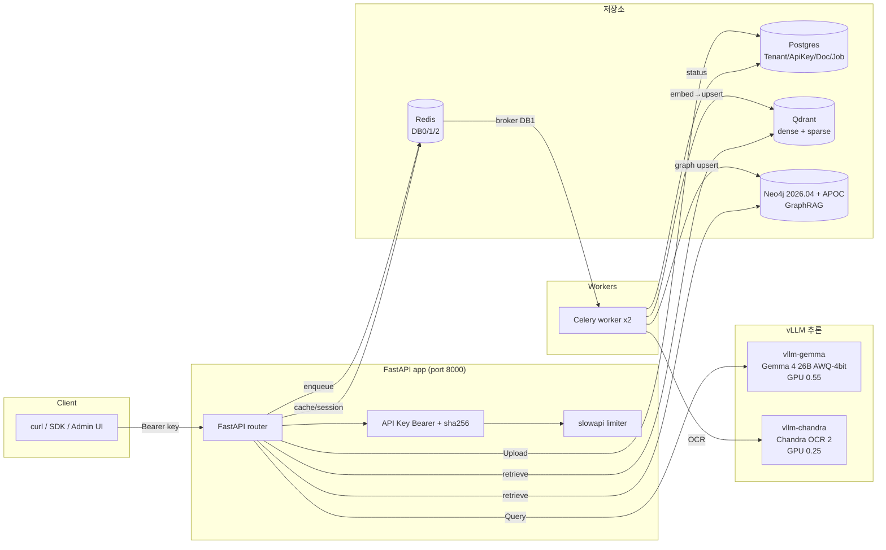
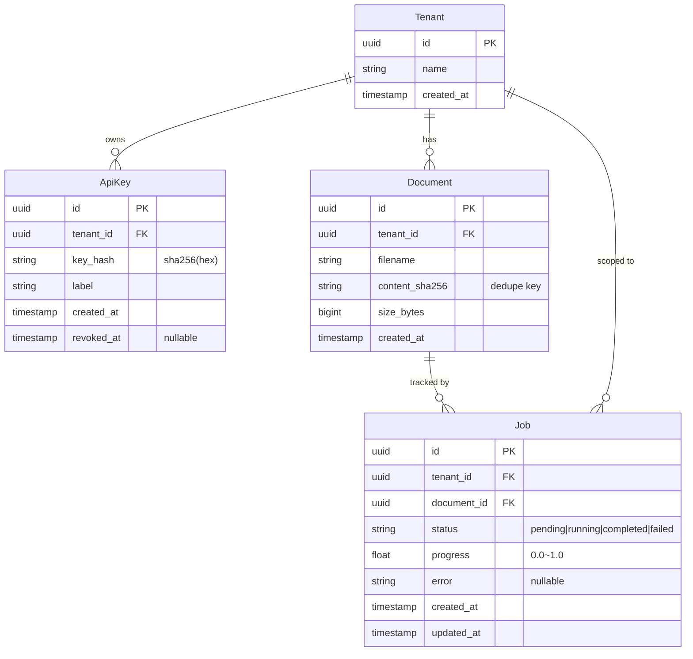
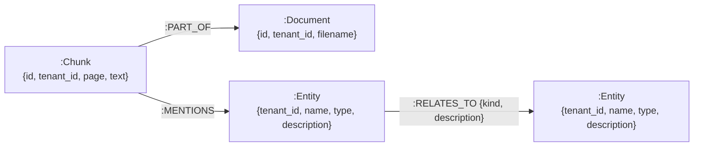
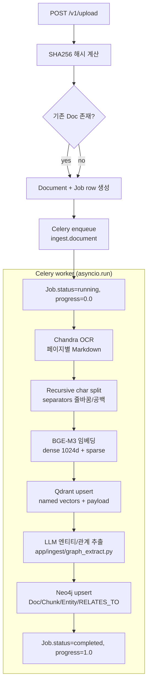
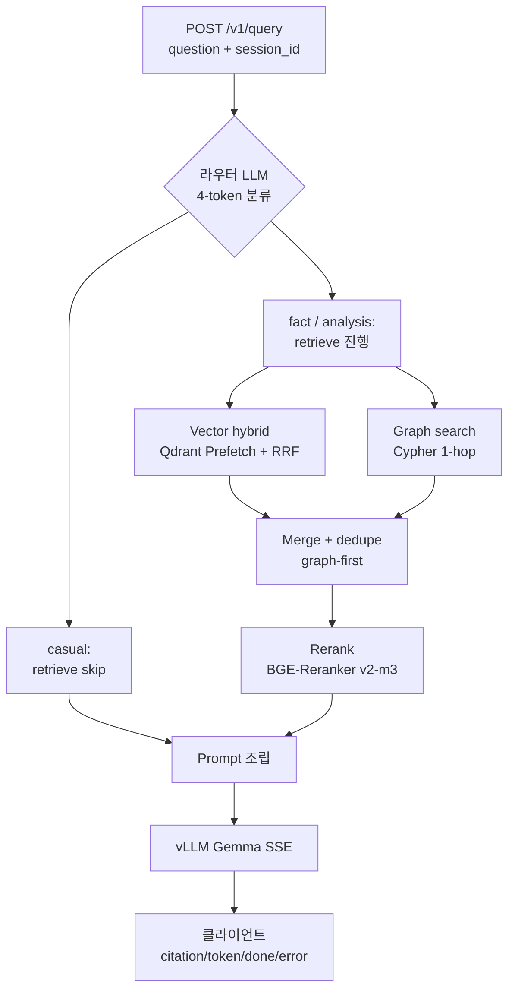

# llm-engine 아키텍처

> 본 문서는 `graphrag/llm-engine`의 심층 아키텍처 레퍼런스이다. README는 Quick Start 와 데모 시나리오에 집중하고, 본 문서는 **컴포넌트 토폴로지 / 데이터 모델 / 파이프라인 / 의사결정 기록(ADR)** 을 다룬다.
> 운영 절차 (배포, 백업, 장애 대응, 메트릭 임계치) 는 별도 `docs/OPERATIONS.md` (작성 예정 — 확인 필요) 를 참조한다.

---

## 시스템 개요

`llm-engine` 은 **DGX Spark (NVIDIA GB10, ARM64)** 단일 노드 위에서 동작하는 **하이브리드 RAG 엔진**이다. "하이브리드" 는 두 가지 의미를 동시에 갖는다.

1. **벡터 (Dense + Sparse) 하이브리드** — Qdrant 의 named vector 컬렉션에 BGE-M3 의 1024차원 dense 임베딩과 lexical sparse 임베딩을 한 포인트에 같이 저장하고, Qdrant Prefetch + RRF Fusion 으로 한 번에 검색한다.
2. **벡터 + 그래프 하이브리드** — 동일한 청크가 Qdrant 에 벡터로, Neo4j 에 `(:Chunk)-[:MENTIONS]->(:Entity)-[:RELATES_TO]->(:Entity)` 그래프로 동시 색인된다. 검색 시 두 경로를 병렬 실행해 결과를 머지한다.

서비스 토폴로지는 `docker-compose.yml` 한 파일로 정의되며, 다음 8개 컨테이너로 구성된다.



핵심 통신 규약:

- **외부 → API**: HTTPS + `Authorization: Bearer <api-key>` (`sk_live_...` 형태).
- **API ↔ vLLM**: 동일 도커 네트워크 내 OpenAI-호환 `/v1/chat/completions`, SSE 스트리밍.
- **API ↔ Celery**: Redis DB1 (broker) + DB2 (result backend) 를 통한 비동기 큐.
- **API ↔ Postgres / Qdrant / Neo4j**: 모두 async 클라이언트 싱글톤. `app/db/*.py` 에서 lazy init.

GPU 점유율은 두 vLLM 서비스가 단일 GB10 을 나눠 쓰도록 `--gpu-memory-utilization 0.55` (Gemma) + `0.25` (Chandra) 로 정적 분할되어 있다. 잔여 0.20 은 BGE-M3 임베딩 / 리랭커 / 시스템 여유분이다.

---

## 컴포넌트 상세

### FastAPI app

- **엔트리포인트**: `app/main.py` — `FastAPI` 인스턴스에 7개 라우터 등록.
- **라우터 7종** (`app/api/*.py`):
  | 라우터 | 경로 | 역할 |
  |--------|------|------|
  | `health` | `GET /healthz`, `/readyz` | 라이브니스 / 레디니스. Postgres·Qdrant·Neo4j·Redis ping. |
  | `auth` | `POST /v1/auth/keys` 등 | API 키 발급/회수 (CLI + 관리용). |
  | `upload` | `POST /v1/upload` | SHA256 dedupe → `Document` row + `Job` row 생성, Celery `ingest.document` enqueue. |
  | `jobs` | `GET /v1/jobs/{id}`, `GET /v1/jobs/{id}/events` | 진행률 조회 + SSE (Postgres 1초 폴링 기반). |
  | `query` | `POST /v1/query` | RAG SSE 스트리밍 (citation / token / done / error 이벤트). |
  | `documents` | `GET/DELETE /v1/documents` | 목록 + cascade 삭제 (Qdrant 포인트, Neo4j Document/Chunk). |
  | `evaluate` | `POST /v1/evaluate` | RAGAS 4-metric (faithfulness, answer_relevancy, context_precision, context_recall). |
- **공통 의존성** (`app/deps.py`):
  - `HTTPBearer(auto_error=False)` 스킴.
  - `current_tenant()` — 헤더에서 키 추출 → sha256 해시 → Postgres `ApiKey` 조회 → `tenant_id` 반환.
  - `get_session()` — `AsyncSession` DI.
- **CORS**: 프로덕션 화이트리스트는 현재 빈 리스트 (개발 시에만 `*`). — 확인 필요: 프로덕션 배포 전 환경변수로 명시 필요.
- **글로벌 핸들러**: `app/core/exceptions.py` — `HTTPException` / Pydantic `ValidationError` / 알 수 없는 `Exception` 을 RFC7807 유사 JSON 으로 변환.

### Celery worker

- **앱**: `app/workers/celery_app.py` — `Celery("llm_engine", broker=redis://redis:6379/1, backend=redis://redis:6379/2, include=["app.workers.tasks"])`.
- **태스크**: 현재 `ingest.document` 단 하나. `bind=True, max_retries=0` — 실패 시 재시도 없이 `Job.status='failed'` 로 마무리.
- **구동 명령**: `celery -A app.workers.celery_app worker --loglevel=INFO --concurrency=2` (`docker-compose.yml` 165 라인). **Celery Beat 서비스는 존재하지 않는다.** 주기 작업 (예: orphan Entity GC) 을 추가하려면 별도 `celery-beat` 서비스 + `beat_schedule` 구성이 필요하다 — `docs/OPERATIONS.md` 작성 시 함께 다룬다.
- **태스크 내부 패턴**:
  ```
  @celery_app.task(name="ingest.document", bind=True, max_retries=0)
  def ingest_document_task(self, ...):
      asyncio.run(_run(...))   # 동기 wrapper → async coroutine
  ```
  `_run` 안에서 매 호출마다 `create_async_engine(postgres_dsn) → async_sessionmaker → await engine.dispose()` 패턴을 반복한다. 단일 워커 프로세스가 다수 태스크를 처리하므로 매 호출 신규 엔진 생성은 비효율적이다 — **알려진 한계** 섹션에서 후속 작업으로 명시한다.

### vLLM Gemma (LLM)

- **모델**: `gemma-4-26b-awq-4bit` (확인 필요: 실제 HF 리포 경로는 환경변수 `VLLM_GEMMA_MODEL`).
- **양자화**: AWQ 4-bit — DGX Spark 의 메모리 대역폭 제약에서 26B 를 단일 GPU 에 올리기 위한 절충.
- **GPU 할당**: `--gpu-memory-utilization 0.55`.
- **사용처 두 가지**:
  1. **쿼리 라우터** — 4-token 분류 (`casual` / `fact` / `analysis`). `temperature=0, max_tokens=4`.
  2. **답변 생성** — RAG 프롬프트 (시스템 룰 + prior_summary + prior_turns + passages + 현재 질문) 를 받아 SSE 스트리밍.
- **호출 측면**: `app/generate/llm.py` — `httpx.AsyncClient` 로 `/v1/chat/completions` 에 `stream=true` POST. SSE 라인을 파싱해 token 이벤트로 변환.

### vLLM Chandra (OCR)

- **모델**: Chandra OCR 2 (멀티모달 이미지→Markdown 모델).
- **GPU 할당**: `--gpu-memory-utilization 0.25`.
- **호출 패턴**: `app/ingest/ocr.py` 에서 각 페이지를 PNG 로 렌더링 → base64 data URI (`data:image/png;base64,...`) → OpenAI 멀티모달 `image_url` 메시지 포맷으로 `/v1/chat/completions` 호출 → 페이지별 Markdown 반환.
- **현재 직렬 실행**: 페이지를 순차 처리한다 — 알려진 한계.

### Qdrant

- **컬렉션 이름**: `settings.qdrant_collection` (기본값 `chunks`, 확인 필요).
- **벡터 구성**: Named vectors 두 개.
  - `dense`: 1024차원, cosine.
  - `sparse`: BGE-M3 lexical (`indices`, `values`).
- **payload 스키마** (`app/ingest/vector_indexer.py` 기준):
  ```
  {
    "tenant_id": "<uuid str>",
    "document_id": "<uuid str>",
    "filename": "report.pdf",
    "page": 3,
    "chunk_index": 12,
    "text": "<원문 청크 텍스트>"
  }
  ```
- **인덱스**: `tenant_id` 필드에 payload 인덱스 — 모든 검색 쿼리에 `Filter(must=[FieldCondition(key="tenant_id", match=...)])` 가 강제로 붙는다 (멀티테넌시 격리).

### Neo4j (GraphRAG)

- **버전**: Community 2026.04.0 + APOC.
- **드라이버**: `app/db/neo4j.py` — 모듈 글로벌 `_driver: AsyncDriver | None = None`. `get_driver()` 가 lazy init.
- **세션 패턴**:
  ```
  async with get_driver().session() as s:
      result = await s.run(cypher, **params)
      await result.consume()
  ```
- **모델은 별도 "데이터 모델" 섹션 참조.**

### Postgres

- **버전**: PostgreSQL 16 (README 16라인 명시 — 확인 필요).
- **드라이버**: `asyncpg` via SQLAlchemy 2.x async.
- **마이그레이션**: Alembic. 현재 `migrations/0001_initial.py` 단 하나.
- **알려진 위험**: `alembic.ini` 의 `sqlalchemy.url` 이 `change_me_postgres` 플레인텍스트로 박혀 있음 → 운영 환경에서 환경변수로 치환 필요.

### Redis (4 역할)

| DB | 용도 | 키 패턴 |
|----|------|---------|
| **DB0** | 일반 캐시 + slowapi 레이트리미트 카운터 + 세션 메모리 | `session:{tenant}:{session_id}:turns`, `session:{tenant}:{session_id}:summary`, `LIMITER/{key}/...` |
| **DB1** | Celery broker | Celery 내부 |
| **DB2** | Celery result backend | Celery 내부 |
| (DB0 공유) | Rate limit | slowapi |

세션 메모리는 `app/generate/session.py` 에서 sliding TTL 로 관리되며, turns LIST 가 한도를 넘으면 LLM 으로 요약(sum-fold)해 summary STRING 으로 폴드한다.

---

## 데이터 모델

### Postgres 스키마

`app/models/orm.py` (확인 필요: 정확한 파일명) 의 ORM 정의를 정리한 ER 다이어그램:



**주요 제약 / 인덱스**:

- `ApiKey.key_hash` UNIQUE — 평문 키는 절대 저장하지 않으며, 발급 시 1회만 클라이언트에 반환.
- `Document(tenant_id, content_sha256)` UNIQUE 복합 인덱스 — 동일 테넌트가 같은 파일을 두 번 올리면 기존 `Document` 를 그대로 재사용 (dedupe).
- `Job.status` 에 부분 인덱스 (확인 필요) — Celery 진행 중 잡 쿼리 가속.

### Qdrant 컬렉션

- **컬렉션**: `chunks` (단일 컬렉션, 멀티테넌트는 payload filter 로 격리).
- **Named vectors**:
  ```
  vectors = {
    "dense":  { size: 1024, distance: Cosine }
  }
  sparse_vectors = {
    "sparse": { modifier: IDF }   # 확인 필요
  }
  ```
- **payload 인덱스**: `tenant_id` (keyword), `document_id` (keyword), `page` (integer).
- **포인트 ID**: `chunk_id` (UUID 문자열).

### Neo4j 그래프 모델



**라벨/속성/dedup 키 (ground truth — `app/ingest/graph_indexer.py`)**:

- `:Document` — 키 `{id}`. 부속 속성: `tenant_id`, `filename`.
- `:Chunk` — 키 `{id}`. 부속 속성: `tenant_id`, `page`, `text` (선두 500자 트렁케이트).
- `:Entity` — **dedup 키 3-튜플** `(tenant_id, name, type)`. 동일한 `Acme/ORG` 라도 테넌트가 다르면 별도 노드. `type` 은 `_VALID_TYPES` 화이트리스트 (PERSON / ORG / LOCATION / EVENT / PRODUCT / DATE / MONEY / POLICY / CONCEPT / OTHER).
- `:MENTIONS` — Chunk → Entity. 속성 없음.
- `:RELATES_TO` — Entity → Entity. `{kind, description}` 속성. `MERGE ... {kind: ...}` 로 같은 종류 관계는 단일 엣지로 dedup.

핵심 Cypher 인용 — Entity MERGE:

```cypher
MERGE (e:Entity {tenant_id: r.tenant_id, name: r.name, type: r.type})
SET e.description = coalesce(e.description, r.description)
```

핵심 Cypher 인용 — Document 삭제 cascade (Entity 는 건드리지 않음):

```cypher
MATCH (d:Document {id: $doc_id, tenant_id: $tenant_id})
OPTIONAL MATCH (c:Chunk)-[:PART_OF]->(d)
DETACH DELETE c, d
```

→ 이로 인해 더 이상 `MENTIONS` 되지 않는 `:Entity` 가 **orphan** 으로 남는다. 별도 GC 태스크 (`graph.cleanup_orphan_entities`, 작성 예정) 가 필요하며, `docs/OPERATIONS.md` 와 후속 Phase 작업 항목으로 트래킹한다.

---

## 인제스트 파이프라인

업로드부터 색인 완료까지의 전체 흐름:



**각 단계 상세**:

1. **업로드 + dedupe** (`app/api/upload.py`)
   - 멀티파트 파일 수신 → 메모리 또는 임시 디스크 → `hashlib.sha256` 으로 전체 본문 해시.
   - `Document(tenant_id, content_sha256)` 으로 SELECT — 있으면 기존 row 그대로 (멱등성), 없으면 INSERT.
   - 항상 새 `Job` row 를 만들고 Celery `ingest.document.delay(job_id, document_id, file_path)` 호출.

2. **OCR — Chandra** (`app/ingest/ocr.py`)
   - PDF 의 경우 `pypdfium2` (확인 필요) 로 페이지를 PNG 렌더 → base64 data URI.
   - 각 페이지에 대해 vLLM Chandra `/v1/chat/completions` 호출. 시스템 프롬프트는 "이미지의 텍스트를 Markdown 으로 충실하게 옮겨라" 류.
   - **현재 직렬 처리**. 페이지 수가 많은 문서는 OCR 단계가 병목. 향후 `asyncio.gather` 기반 N-동시성 추가 (한계 섹션 참조).

3. **청크화** (`app/ingest/chunker.py`)
   - 알고리즘: Recursive Character Text Splitter.
   - 우선순위 separator: `["\n\n", "\n", ". ", " "]`.
   - 청크 크기 / 오버랩은 `settings.chunk_size`, `settings.chunk_overlap` (확인 필요 — 환경변수).
   - 출력: `Chunk(page, chunk_index, text)` 리스트.

4. **임베딩 — BGE-M3** (`app/ingest/embedder.py`)
   - **싱글톤 lazy 로딩** — 첫 호출 시 모델 적재 (수 GB, 수십 초 소요).
   - 한 번의 forward 로 `dense (1024d float)` + `sparse (indices/values)` 동시 산출.
   - **현재 asyncio 컨텍스트에서 직접 `model.encode(...)` 동기 호출** — CPU/GPU bound 작업을 `run_in_executor` 로 옮기지 않아 이벤트 루프 점유. 한계로 명시.

5. **Qdrant upsert** (`app/ingest/vector_indexer.py`)
   - 청크당 한 포인트. ID = `chunk_id` (UUID).
   - `vector={"dense": [...], "sparse": SparseVector(indices, values)}` 형태로 단일 호출.
   - payload 에 `tenant_id`/`document_id`/`filename`/`page`/`chunk_index`/`text`.

6. **그래프 추출** (`app/ingest/graph_extract.py`)
   - 청크 텍스트를 Gemma 에 보내 JSON 으로 `{entities: [...], relations: [...]}` 추출.
   - 추출 LLM 호출은 청크 수만큼 발생 — 양이 많은 문서일수록 비용/시간 지배 요인. 결과는 `_VALID_TYPES` 화이트리스트로 후필터링.

7. **Neo4j upsert** (`app/ingest/graph_indexer.py`)
   - 단일 트랜잭션 안에 `:Document` MERGE → `:Chunk` MERGE → `:PART_OF` MERGE → `:MENTIONS` MERGE → `:Entity` MERGE → `:RELATES_TO` MERGE 순.
   - 모든 MERGE 는 idempotent — 잡 재실행해도 그래프가 부풀지 않는다.

8. **상태 갱신**
   - 각 주요 단계 후 `Job.progress` 를 점진적으로 0.0 → 1.0 으로 업데이트.
   - `Job.status` 는 `pending → running → completed | failed`.

**실패 시나리오 & 재시도**:

| 단계 | 흔한 실패 | 현재 동작 | 향후 |
|------|----------|-----------|------|
| OCR | vLLM Chandra 5xx / timeout | `Job.status=failed`, 전체 잡 중단 | per-page 재시도 + exponential backoff |
| 임베딩 | 모델 OOM | 마찬가지로 전체 실패 | 청크 배치 분할 |
| Qdrant upsert | 컬렉션 미존재 / 네트워크 | 실패 | 컬렉션 부트스트랩 헬스체크 |
| Neo4j upsert | constraint violation / 락 타임아웃 | 실패 | `max_retries>=3` + 지수 백오프 |

현재 `max_retries=0` 이라 어떤 단계에서든 한 번 죽으면 작업 전체가 실패한다. 운영 안정성을 위해 `max_retries=3 + retry_backoff=True` 로 변경하는 것이 후속 작업.

---

## 검색 파이프라인

쿼리 한 번의 전체 흐름:



### 쿼리 라우터 (LLM)

- **파일**: `app/retrieve/router.py`.
- **모델**: Gemma. `temperature=0, max_tokens=4`.
- **프롬프트 형식**: 시스템 프롬프트가 "casual / fact / analysis 중 하나만 출력하라" 류이며, 4-token 안에 답이 종료된다.
- **fallback**: 응답이 화이트리스트 밖이거나 timeout/오류면 `fact` 로 fallback. casual 일 때만 retrieve 단계를 통째로 건너뛰고 일반 챗 모드로 진입.
- **목적**: 비용 절감 + 단순 인사/감사 등에 불필요한 retrieve 호출 방지.

### 벡터 하이브리드 검색 (Qdrant Prefetch + RRF Fusion)

- **파일**: `app/retrieve/vector.py`.
- **알고리즘**: Qdrant 1.10+ 가 제공하는 **Prefetch + FusionQuery(RRF)**. 두 개의 prefetch 를 병렬로 실행한 뒤 한 번의 응답에서 RRF 융합 결과를 받는다.
- **핵심 호출** (`app/retrieve/vector.py:49-68`):

  ```python
  response = await client.query_points(
      collection_name=settings.qdrant_collection,
      prefetch=[
          qm.Prefetch(
              query=q.dense,
              using="dense",
              limit=top_k * 4,
              filter=flt,
          ),
          qm.Prefetch(
              query=qm.SparseVector(indices=q.sparse_indices,
                                    values=q.sparse_values),
              using="sparse",
              limit=top_k * 4,
              filter=flt,
          ),
      ],
      query=qm.FusionQuery(fusion=qm.Fusion.RRF),
      limit=top_k,
      with_payload=True,
  )
  ```

- **RRF (Reciprocal Rank Fusion) 수식**:

  ```
  RRF(d) = sum over i in {dense, sparse} of  1 / (k + rank_i(d))
  ```

  - `rank_i(d)` 는 결과 i 에서 문서 d 의 1-based 순위. 한쪽 결과에 없으면 그 항은 0.
  - Qdrant 기본 `k = 60` (확인 필요 — Qdrant 버전에 따라 상수). RRF 의 장점은 점수 스케일이 다른 두 리트리버(코사인 vs sparse) 의 결과를 정규화 없이 결합할 수 있다는 점.
  - 오버샘플 비율 `top_k * 4` — 두 후보 풀을 충분히 깊게 확보한 뒤 융합.

- **테넌트 격리**: `Filter(must=[FieldCondition(key="tenant_id", match=MatchValue(value=str(tenant_id)))])` 가 양쪽 prefetch 에 동일하게 적용된다.
- **임베딩 단계 입력**: 질의는 BGE-M3 의 동일 모델로 dense + sparse 동시 인코딩.

### 그래프 검색 (Cypher 1-hop)

- **파일**: `app/retrieve/graph.py`.
- **알고리즘**:
  1. 질의에서 후보 엔티티 토큰 추출 (현재 단순 토크나이즈).
  2. Cypher 로 `:Entity` 시드 매칭 — `WHERE toLower(seed.name) CONTAINS toLower($q)` substring 방식.
  3. 1-hop `RELATES_TO` 로 인접 Entity 확장.
  4. 인접 Entity 에 `MENTIONS` 된 `:Chunk` 들을 수집.
  5. `(document_id, chunk_index)` 별 dedupe 후 상위 N 반환.
- **시드 매칭 한계**: substring 으로 짧은 엔티티명(예: 두 글자 약어) 이 다른 토큰에 잘못 매칭될 수 있다 — 향후 정규화/exact match 강화.
- **테넌시**: Cypher 모든 MATCH 에 `tenant_id = $tenant_id` 가드.

### 머지 & 디둽

- **파일**: `app/retrieve/orchestrator.py`.
- **현재 정책** (`_merge`):
  - **graph-first prepend** — 그래프 결과를 항상 앞에, 그 뒤에 벡터 결과 부착.
  - dedupe 키: `(document_id, chunk_index)` 튜플.
- **한계**: graph 시드가 노이즈일 때 (예: 짧은 약어 substring 오매칭) 노이즈가 항상 최상단을 차지하게 된다. 향후 **혼합 스코어링 (graph 신뢰도 × 벡터 RRF)** 으로 전환 필요.

### BGE-Reranker v2-m3

- **파일**: `app/retrieve/reranker.py`.
- **모델**: BAAI/bge-reranker-v2-m3 cross-encoder.
- **점수**: cross-encoder 의 logit 을 `sigmoid` 로 0~1 정규화.
- **사용**: 머지 후 상위 K 후보를 reranker 에 한 번에 넣어 재정렬.
- **fail-soft**: 모델 적재 / 추론 실패 시 원래 순서를 그대로 사용 — 사용자 응답은 깨지지 않는다.
- **알려진 한계**:
  - lazy 싱글톤 → cold start 발생.
  - uvicorn `--workers>1` 환경에서 워커마다 중복 적재 → 메모리 비용.

### 프롬프트 조립

`app/generate/prompt.py` 가 다음 순서로 조립한다.

1. **System rules** — 답변 톤, 인용 형식, 모르는 경우 명시 등.
2. **prior_summary** — Redis 에서 가져온 누적 요약 (있을 경우만).
3. **prior_turns** — Redis 에서 가져온 최근 turn(예: 최대 6턴, 확인 필요).
4. **passages** — reranker 결과 상위 N개. `"[{i}] ({filename} p.{page}): {text}"` 포맷.
5. **Question** — 현재 질문.

각 passage 는 인용 인덱스를 가지며 응답 SSE 의 `citation` 이벤트로 미리 클라이언트에 push 된다.

### SSE 이벤트 형식

`/v1/query` 응답은 `text/event-stream` 으로 다음 4종 이벤트를 emit 한다.

| event | data 예시 | 의미 |
|-------|-----------|------|
| `citation` | `{"index": 1, "filename": "report.pdf", "page": 3, "score": 0.87}` | 본문 인용으로 사용될 passage 메타. token 전에 한꺼번에 송출. |
| `token` | `{"delta": "안녕"}` | LLM 부분 출력. 다수 송출. |
| `done` | `{"finish_reason": "stop"}` | 정상 종료. |
| `error` | `{"code": "vllm_unavailable", "message": "..."}` | 실패. 스트림 종료. |

클라이언트는 citation → token → done 순서를 가정해도 안전하다.

---

## 세션 메모리 (Redis)

`app/generate/session.py`.

**키 구조** (DB0):

```
session:{tenant_id}:{session_id}:turns      LIST   ← 최근 turn JSON
session:{tenant_id}:{session_id}:summary    STRING ← 누적 요약
```

**Sliding TTL**: 매 접근마다 `EXPIRE` 를 재설정해 활동 기반 만료. 기본 TTL `settings.session_ttl_seconds` (확인 필요).

**Sum-fold 알고리즘**:

1. 새 turn 을 LIST 에 LPUSH.
2. `LLEN > MAX_TURNS` 이면 (1) 최오래된 N개를 LTRIM 으로 잘라내 (2) 잘라낸 내용 + 기존 summary 를 Gemma 로 요약 → 새 summary STRING SET.
3. 결과: turns 는 슬라이딩 윈도우, summary 는 영구 누적.

**프롬프트 합류**: 검색 단계 직전에 `summary` + `turns` 를 통째로 읽어 system 메시지 다음에 끼워 넣는다.

---

## 인증 & 멀티테넌시

- **방식**: API Key Bearer.
- **발급**: `scripts/create_api_key.py` (Phase 5b) 또는 `POST /v1/auth/keys`. 발급 시 32바이트 랜덤 → `sk_live_<base64>` 형태로 클라이언트에 1회 반환.
- **저장**: 평문이 아니라 sha256(hex) 해시만 `ApiKey.key_hash` 에 INSERT.
- **검증 흐름** (`app/deps.py::current_tenant`):
  1. `Authorization: Bearer <raw>` 헤더 파싱.
  2. `sha256(raw)` 계산.
  3. `SELECT ... FROM api_key WHERE key_hash = $1 AND revoked_at IS NULL` (Postgres).
  4. 결과의 `tenant_id` 를 request state 에 주입 + 의존성 반환값.
- **테넌트 격리**:
  - Postgres: 모든 조회 쿼리에 `WHERE tenant_id = $current` 가드 (애플리케이션 레벨 — DB 레벨 RLS 미사용. 확인 필요).
  - Qdrant: payload filter `tenant_id` 강제.
  - Neo4j: Cypher 모든 MATCH 에 `{tenant_id: $tenant_id}` 가드.
  - Redis: 키 prefix 에 tenant_id 포함.

**한계**:

- DB 레벨 RLS 가 아니므로, 새 라우터/쿼리를 추가할 때 `tenant_id` 가드를 빠뜨리면 누수 위험. 코드 리뷰 체크리스트로 보강하거나 향후 Postgres RLS 도입.
- Revoke 후에도 토큰이 캐시에 떠 있을 수 있는지 확인 필요 (현재 캐시는 없는 것으로 보임).

---

## 레이트리미트 & 관측성

### slowapi

- **파일**: `app/core/limiter.py`.
- **현재 정책**: `default_limits=[f"{settings.rate_limit_per_minute}/minute"]` 만 적용. **개별 라우트 데코레이터 (`@limiter.limit(...)`) 는 부착되어 있지 않음** — 한계 섹션 참조.
- **키 함수**: API 키 sha256 해시 기반 → 테넌트별 카운터.
- **응답**: 한도 초과 시 `429 Too Many Requests` + `Retry-After` 헤더.

### structlog

- **포맷**: JSON.
- **공통 필드**: `event`, `timestamp`, `level`, `request_id`, `tenant_id` (request scope), 그리고 라우터/태스크별 추가 필드.
- **연동**: FastAPI middleware 가 `X-Request-Id` 헤더를 ensure/forward 하고 structlog 컨텍스트에 바인드.

### Access log

Phase 5c 에서 활성화. 요청 단위로 `method`, `path`, `status`, `duration_ms`, `tenant_id`, `key_id` 가 JSON 으로 기록된다.

---

## 알려진 한계 & 향후 작업

다음 항목들은 ground truth 의 "Known risks" 와 이번 문서 작성 과정에서 발견한 사항을 통합한 후속 작업 목록이다. 운영 절차/SLO 는 `docs/OPERATIONS.md` (작성 예정), 개별 코드 변경은 Phase 7 sub-issue 로 트래킹한다.

| # | 영역 | 현재 상태 | 영향 | 후속 |
|---|------|----------|------|------|
| 1 | **README ↔ 실제 코드 동기화** | README "Phase 7 - TODO" 단일 항목 + 테스트 수치 (172/95.63%) 하드코딩 | 진행 상황 추적 불가, 문서 신뢰도 저하 | README 분할 (Quick Start vs Demo vs Phase) + Phase Status 자동 생성. |
| 2 | **alembic.ini 평문 DSN** | `change_me_postgres` 박힘 | 운영 누출 위험 | `${POSTGRES_DSN}` 환경변수 치환 + `.env.example` 보강. |
| 3 | **default `change_me_*`** | config.py 디폴트 | 잘못된 배포 시 약한 자격증명 | startup validation — 운영 환경에서 default 값이면 즉시 fail. |
| 4 | **CORS 화이트리스트 = []** | 프로덕션 공란 | 브라우저 클라이언트 차단 | 환경변수 `ALLOWED_ORIGINS` 로 분리. |
| 5 | **라우트 데코레이터 부재** | `default_limits` 만 | 개별 비싼 라우트 (e.g. `/v1/query`) 무방비 | `@limiter.limit("30/minute")` 부착 + 라우터별 정책 표. |
| 6 | **Celery max_retries=0** | 한 번 실패 = 잡 종료 | 일시적 네트워크 오류로 영구 실패 | `max_retries=3, retry_backoff=True` + idempotency 보강. |
| 7 | **태스크당 신규 async engine** | `create_async_engine` → `dispose` 매 호출 | 커넥션 풀 무효화, 비효율 | 워커 부팅 1회 + 모듈 글로벌 풀. |
| 8 | **Job SSE 1초 폴링** | Postgres `SELECT` 최대 600초 | 동시 잡 수 ↑ 시 DB 부하 | Redis pub/sub 기반 push 전환. |
| 9 | **그래프 시드 substring 매칭** | `toLower(name) CONTAINS toLower($q)` | 짧은 이름 오매칭 | exact match + length 가드 + alias 인덱스. |
| 10 | **`_merge` graph-first 고정** | 항상 prepend | 노이즈 시드가 최상단 차지 | 그래프 신뢰도 × 벡터 RRF 결합. |
| 11 | **Reranker cold start** | lazy 싱글톤, 워커 dup | 첫 요청 지연, 메모리 낭비 | 워커 부팅 시 warm-up + 별도 사이드카 서비스화 검토. |
| 12 | **OCR 직렬 처리** | 페이지별 순차 | 다페이지 PDF 병목 | `asyncio.gather(*[..], return_exceptions=True)` + 동시성 cap. |
| 13 | **임베딩 `run_in_executor` 누락** | asyncio 컨텍스트 직접 호출 | 이벤트 루프 점유 | `loop.run_in_executor` 또는 `anyio.to_thread`. |
| 14 | **Entity orphan GC 부재** | `delete_document_graph` 가 Entity 미삭제 | Neo4j 노드 무한 누적 | `graph.cleanup_orphan_entities` 태스크 + celery-beat 추가. |
| 15 | **docs/ 빈 디렉터리** | 본 문서가 첫 입주 | 정보가 README 에 과집중 | `OPERATIONS.md` / `RUNBOOKS.md` / `EVAL.md` 추가. |

---

## ADR 인덱스

본 문서는 현 시점에서 경량 ADR (Architecture Decision Records) 집합 역할을 겸한다. 향후 결정이 늘어나면 별도 `docs/adr/NNN-*.md` 분리.

### ADR-001 — 하이브리드 RAG = Qdrant + Neo4j 선택

**컨텍스트**. DGX Spark 단일 노드 위에서 한국어 / 영어 혼합 문서에 대한 RAG 를 구현해야 한다. 후보는 (a) 벡터 단독 (Qdrant / pgvector / Weaviate), (b) 그래프 단독 (Neo4j GraphRAG / Memgraph), (c) 두 가지 결합. 한국어 OCR 결과는 명사 표면형 변이가 많아 dense 단독으로는 fact-recall 이 약하고, 반대로 그래프 단독은 추출 LLM 의 entity 누락 시 회수 자체가 막힌다.

**결정**. **Qdrant (dense+sparse named vectors) + Neo4j (GraphRAG)** 를 병렬 실행 후 머지하는 하이브리드를 채택한다. 벡터 측에서 dense+sparse 를 함께 두는 이유는 BGE-M3 한 모델이 두 표현을 동시에 산출하므로 추가 비용이 거의 없으며, RRF 가 두 결과를 점수 정규화 없이 결합해주기 때문이다. 그래프 측은 1-hop `RELATES_TO` 만 사용해 비용을 통제한다.

**결과 / 영향**. (+) fact-style 질의에서 그래프가, paraphrase/장문 질의에서 벡터가 서로 보완. (+) Qdrant Prefetch + FusionQuery 단일 API 호출로 백엔드 왕복 1회. (-) 두 저장소를 모두 유지해야 하므로 운영 부담 증가. (-) 머지 정책 (graph-first prepend) 이 순진하여 노이즈 시드 시 품질 저하 — **알려진 한계 #10** 으로 트래킹.

### ADR-002 — BGE-Reranker v2-m3 도입

**컨텍스트**. Qdrant RRF 결과 + 그래프 결과를 머지하면 상위 K (예: 20) 후보 중 실제로 좋은 passage 가 1–3위에 항상 오지는 않는다. cross-encoder 리랭킹은 bi-encoder 리트리벌과 별개 신호 (질의-문서 cross attention) 를 제공한다.

**결정**. **BAAI/bge-reranker-v2-m3** cross-encoder 를 머지 후, 프롬프트 조립 전에 삽입한다. 점수는 sigmoid 정규화로 0~1 범위에 둔다. 실패 시 (모델 적재 실패 / 추론 timeout) 원래 순서를 그대로 사용하는 fail-soft 정책.

**결과 / 영향**. (+) 머지 정책의 graph-first prepend 단점을 부분적으로 상쇄 — 그래프 prepend 라도 reranker 가 후순위로 떨어뜨릴 수 있다. (+) 다국어 (m3) 호환. (-) lazy 싱글톤이라 첫 요청 cold start, 멀티워커 환경에서 중복 적재 — **한계 #11**. (-) RAG 파이프라인 latency 에 ~수십~수백 ms 추가.

### ADR-003 — Celery 비동기 인제스트 (vs FastAPI BackgroundTasks)

**컨텍스트**. PDF 한 건 인제스트는 OCR + LLM 엔티티 추출 + 임베딩 + 색인까지 분 단위가 걸린다. FastAPI 단일 프로세스에서 `BackgroundTasks` 로 처리하면 (a) 워커 프로세스가 죽으면 잡 손실, (b) 진행률 추적이 어렵고, (c) 수평 확장 불가.

**결정**. **Celery 비동기 큐 (Redis broker DB1, backend DB2)** 채택. `ingest.document` 단일 태스크가 모든 단계를 동기 wrapper 안에서 `asyncio.run` 으로 실행한다. 진행률은 Postgres `Job` row 에 `progress 0.0~1.0` 와 `status` 로 영속화한다.

**결과 / 영향**. (+) API 프로세스 재시작과 무관하게 잡 지속. (+) 워커 수평 확장 (`--concurrency` 또는 컨테이너 복제) 으로 처리량 조절. (+) `Job` row + SSE 로 진행률 가시화. (-) Celery beat 가 없어 주기 태스크 (orphan GC 등) 추가 시 인프라 변경 필요 — **한계 #14**. (-) 현재 `max_retries=0` + 매 호출 신규 async engine 생성 — **한계 #6, #7**.

---

## 부록 A — 모듈 맵 (`app/*`)

| 디렉터리 | 핵심 파일 | 역할 |
|----------|-----------|------|
| `api/` | `health.py`, `auth.py`, `upload.py`, `jobs.py`, `query.py`, `documents.py`, `evaluate.py` | 7개 라우터. |
| `core/` | `auth.py`, `limiter.py`, `exceptions.py` | 횡단 관심사. |
| `db/` | `postgres.py`, `qdrant.py`, `neo4j.py`, `redis.py` | 각 DB 의 클라이언트 싱글톤 + ping. |
| `deps.py` | — | DI: Bearer 스킴, async session, `current_tenant`. |
| `evaluate/` | `ragas_runner.py` (확인 필요) | RAGAS 4 metric. |
| `generate/` | `llm.py`, `prompt.py`, `session.py`, `streamer.py` | vLLM SSE 클라이언트, 프롬프트, 세션 메모리. |
| `ingest/` | `pipeline.py`, `ocr.py`, `chunker.py`, `embedder.py`, `vector_indexer.py`, `graph_extract.py`, `graph_indexer.py` | 인제스트 단일 진입점 + 단계별 모듈. |
| `models/` | `orm.py` (확인 필요), `schemas.py` (확인 필요) | SQLAlchemy ORM + Pydantic. |
| `retrieve/` | `router.py`, `vector.py`, `graph.py`, `reranker.py`, `orchestrator.py` | 검색 오케스트레이션. |
| `utils/` | `logging.py`, `hashing.py` | structlog, sha256. |
| `workers/` | `celery_app.py`, `tasks.py` | Celery 앱 + `ingest.document`. |

---

## 부록 B — 환경 변수 요약 (요점만)

| 변수 | 기본값 / 예시 | 비고 |
|------|---------------|------|
| `POSTGRES_DSN` | `postgresql+asyncpg://...` | Alembic `sqlalchemy.url` 도 이를 가리켜야 한다. |
| `QDRANT_URL` | `http://qdrant:6333` | |
| `QDRANT_COLLECTION` | `chunks` | named vectors 컬렉션. |
| `NEO4J_URL` | `bolt://neo4j:7687` | |
| `NEO4J_USER` / `NEO4J_PASSWORD` | `neo4j` / `change_me_neo4j` | 운영에서 반드시 교체. |
| `REDIS_URL` | `redis://redis:6379/0` | |
| `CELERY_BROKER_URL` | `redis://redis:6379/1` | |
| `CELERY_RESULT_BACKEND` | `redis://redis:6379/2` | |
| `VLLM_GEMMA_URL` | `http://vllm-gemma:8000/v1` | OpenAI 호환. |
| `VLLM_CHANDRA_URL` | `http://vllm-chandra:8000/v1` | OpenAI 호환. |
| `RATE_LIMIT_PER_MINUTE` | `60` | slowapi default_limits. |
| `SESSION_TTL_SECONDS` | 확인 필요 | sliding TTL. |
| `CHUNK_SIZE` / `CHUNK_OVERLAP` | 확인 필요 | recursive splitter. |
| `ALLOWED_ORIGINS` | `[]` (운영) / `*` (개발) | CORS. |

---

## 부록 C — 텍스트 다이어그램 모음 (mermaid 가 렌더 안 되는 환경용)

**인제스트 ASCII**:

```
Upload  --> sha256 dedupe --> Document/Job row
                                  |
                                  v
                          Celery ingest.document
                                  |
              +-------------------+-------------------+
              v                                       v
            OCR (Chandra)                       (단계별 진행률 업데이트)
              |
              v
            Chunker (recursive split)
              |
              v
            BGE-M3 embed (dense + sparse)
              |
        +-----+-----+
        v           v
     Qdrant     graph_extract (Gemma JSON)
                    |
                    v
                 Neo4j upsert (Doc/Chunk/Entity/RELATES_TO)
```

**검색 ASCII**:

```
/v1/query
   |
   v
Router LLM (4-token) -- casual --> skip retrieve --> chat
   |
   +-- fact / analysis
            |
   +--------+--------+
   v                 v
Vector (RRF)     Graph (1-hop)
   +--------+--------+
            v
         Merge (graph-first dedupe)
            |
            v
         BGE-Reranker v2-m3 (sigmoid)
            |
            v
         Prompt 조립 (system + summary + turns + passages + Q)
            |
            v
         vLLM Gemma SSE --> citation / token / done / error
```

---

## 부록 D — 참고 / 갱신 책임

- 본 문서는 `app/*` 의 ground truth 와 직접 동기화되어야 한다. 새 라우터 / 새 인제스트 단계 / 새 Cypher MERGE 가 추가될 때 본 문서의 해당 섹션도 같은 PR 에서 갱신한다.
- README 의 "Phase Status" 와는 별도 — README 는 사용자/평가자 시점, 본 문서는 엔지니어 시점이다.
- 결정의 근거가 큰 ADR (예: Reranker 교체, 벡터 DB 교체) 은 본 ADR 인덱스에 항목을 추가한다.

(문서 끝)
